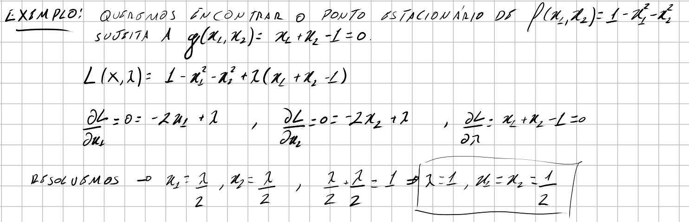
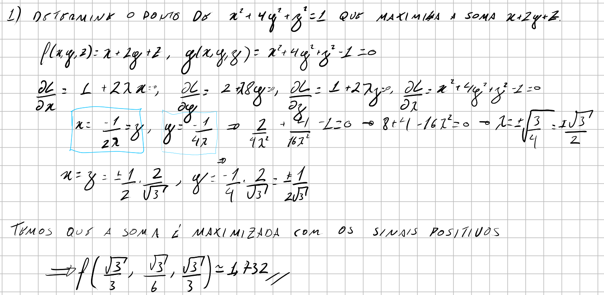
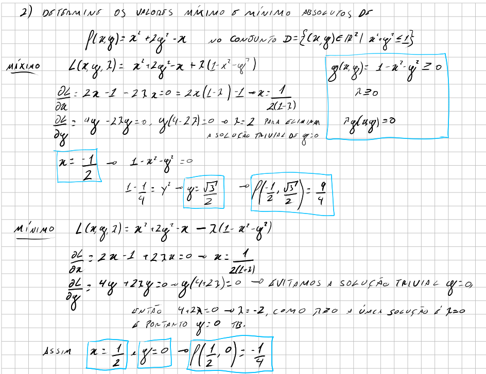
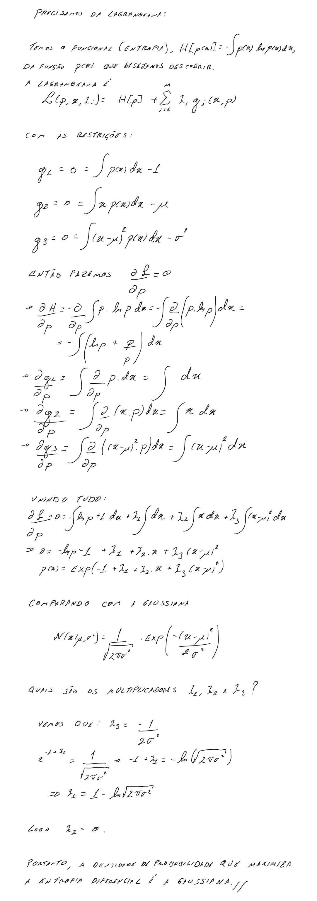

(lagrange-multipliers)=
# Multiplicadores de Lagrange

Em machine learning vemos constantemente funções de perda com restrições, normalmente em forma de uma regularização. Por exemplo, digamos que você esteja fazendo uma regressão linear de modo a minimizar a quantidade

$$argmin_{\mathbf{w}} \frac{1}{N}\sum_{i=1}^{N}\vert y_{i} - \mathbf{w}^{T}x_{i} \vert^{2},$$

onde $\mathbf{w}$ é o seu vetor com os parâmetros do modelo. Isso poderia bastar para seu modelo, mas pode ser também que você entende que existe uma restrição para o vetor de parâmetros do seu modelo, digamos $\mathbf{w}^{T}\mathbf{w}=1$. Com isso você inclui uma restrição à otimização que deseja realizar. Restrições como essa aparecem em vários casos em machine learning, física, matemática, etc.
Para resolver esse tipo de _Otimização restrita_, existe um famoso método que podemos usar chamado, Multiplicadores de Lagrange.

O problema envolve querer maximizar ou minimizar uma função de várias variáveis $f(\mathbf{x})$, sujeita à restrição da forma $g(\mathbf{x})=0$. Note que $\mathbf{x} = (x_{1},x_{2}, ..., x_{n})$. Se $\mathbf{x}$ for $D$-dimensional, a restrição corresponde a um subespaço $(D-1)$-dimensional. Se $\mathbf{x}$ tiver 2 dimensões a restrição vai corresponder a uma curva no plano.

Consideremos o caso de maximizar $f(\mathbf{x})$. Ao calcular $\nabla f(\mathbf{x})$ obtemos o vetor que informa a direção que função $f(\mathbf{x})$ mais cresce (se não houver nenhum tipo de restrição, o máximo da função pode ser infinito), podemos entender isso como uma força empurrando a função para seu valor máximo. Quando há uma restrição, outra força similar a essa aparece na direção oposta, $\nabla g(\mathbf{x})$. A otimização ocorre até um ponto que há um equilíbrio de forças, ou seja, 

$$\nabla f(\mathbf{x}) + \lambda \nabla g(\mathbf{x}) = 0,$$

onde $\lambda$ é um fator de escala diferente de zero chamado de multiplicador de Lagrange. Se considerarmos que a soma de $f(\mathbf{x})$ com sua restrição é a nova função que desejamos maximizar, podemos escrever a função de Lagrange:

$$\text{Maximizar: }\mathcal{L}(\mathbf{x},\lambda) = f(\mathbf{x}) + \lambda g(\mathbf{x})$$

e agora queremos encontrar a solução de:

$$\nabla \mathcal{L}(\mathbf{x},\lambda) = 0$$

Ou seja, isso nos dará um sistema de equações cuja solução fornecerá o máximo da função $f(\mathbf{x})$ quando sujeita a restrição $g(\mathbf{x})$.

Caso nosso objetivo seja minimizar $f(\mathbf{x})$, apenas modificamos o sinal da restrição na função de Lagrange:

$$\text{Minimizar: }\mathcal{L}(\mathbf{x},\lambda) = f(\mathbf{x}) - \lambda g(\mathbf{x})$$

As restrições podem aparecer no formato de desigualdades, não há problema nisso, precisamos apenas modificá-las, se necessário para atender os requisitos:

- $g(\mathbf{x}) \ge 0$
- $\lambda \ge 0$
- $\lambda g(\mathbf{x}) = 0$

```{note}
Na verdade a técnica de Multiplicadores de Lagrange só aceita restrições com igualdades, a forma com desigualdades é uma generalização e é chamada de Multiplicadores de Karush-Kuhn-Tucker (KKT). Veremos isso mais adiante quando falarmos de regularização em machine learning.
```

Observe que podemos ter mais de uma restrição no problema, nesse caso cada restrição recebe um multiplicador de Lagrange diferente e todas são somadas na função de Lagrange.

Vejamos alguns exemplos simples:

<!--  -->
```{image} ../../images/mult_lagrange_ex_1.png
:alt: mult_lagrange_ex_1
:width: 800px
:align: center
```
<!--  -->
```{image} ../../images/mult_lagrange_ex_2.png
:alt: mult_lagrange_ex_2
:width: 800px
:align: center
```

<!--  -->
```{image} ../../images/mult_lagrange_ex_3.png
:alt: mult_lagrange_ex_3
:width: 800px
:align: center
```

Podemos ainda mostrar com esse método que a distribuição normal é aquela de maximiza e entropia de Shanon:

<!--  -->
```{image} ../../images/mult_lagrange_ex_4.png
:alt: mult_lagrange_ex_4
:width: 800px
:align: center
```